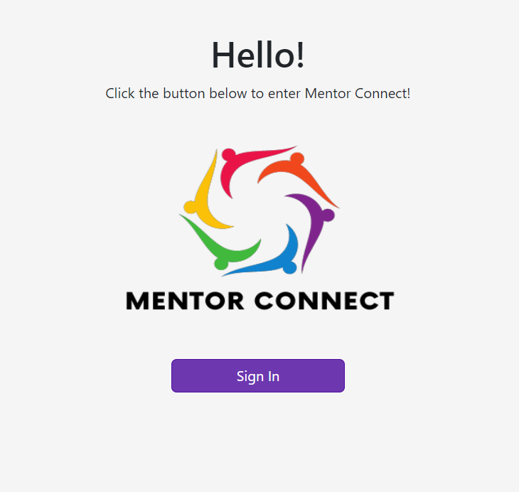
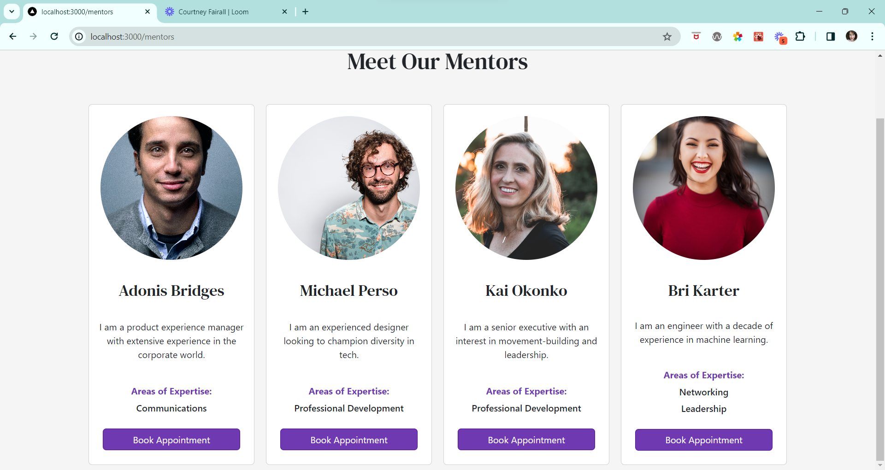
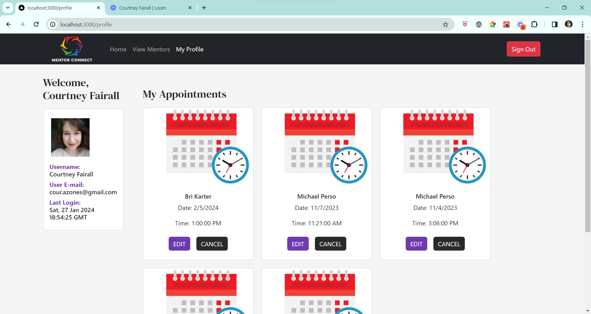

# Mentor Connect

Mentor Connect is a space where anyone seeking guidance in their professional career can connect with experienced mentors based on their varying areas of expertise by booking appointments.

## About the User
- The ideal user for this application is a young professional seeking mentorship in their career.
- The problem this app solves is to give people a space where they can find mentors to help them, book appointments with them, and ultimately foster a community that will help them grow and develop.

## Features 
- The user must first log in with their google account to enter Mentor Connect.
- The user will be welcomed to a landing page where they can learn about our organization.
- From here, the user can browse available mentors and book an appointment with them.
- Once an appointment is booked, the user is directed to their profile page which will display profile information, along with all appointments the user has booked. 
- From here, the user can also update or cancel (delete) their appointments if necessary.

## Video Walkthrough of Mentor Connect
https://www.loom.com/share/adbcc02997dd4a7d8f96595fa70a33e9?sid=db9ecbb9-eab7-401d-aff1-f9ee7856590f

## Relevant Links 
- [Check out the deployed site (front end)](https://mentorship-connect.netlify.app/)
- [Wireframes](https://www.figma.com/file/ijqNETxi8pzegsJaCBDr2U/Mentorship?type=design&node-id=1-21&mode=design&t=cYDqFXFpQsptKU2K-0)
- [Project Board](https://github.com/orgs/nss-evening-cohort-24/projects/30/views/1)

## Project Screenshots

## Contributors
- [Courtney Fairall](https://github.com/cnfairall)
- [Dylan Moore](https://github.com/dylankmoore)
- [Nathan Clover](https://github.com/cloverww04)
- [Sheryl Boles](https://github.com/reneesb)
